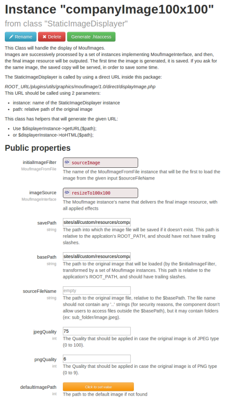
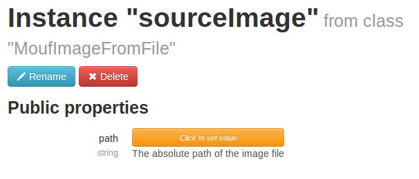
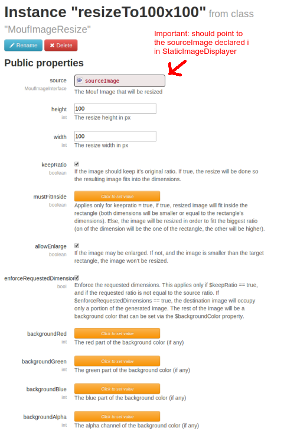
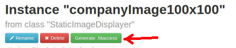

Graphics image preset displayer
===============================

What is this package
--------------------

This package is used to resize/modify images dynamically on a website.
It requires [Mouf](http://mouf-php.com) and Apache as a web-server.

How does it work?
-----------------

You store the images to be resized/transformed in a directory. For instance: `images/original`.
You would normally access those images like this: `http://[myserver]/[myapp]/images/original/test.png`.
Instead, using this package, you can access `http://[myserver]/[myapp]/images/small/test.png`.

If the `test.png` image does not exist in the `small` directory, it will be automatically resized,
and stored in that directory (thanks to a `.htaccess` file stored in the `small` directory).
Once the image has been generated, the image will be served statically.
Therefore, the cost of resizing the image is only paid once, the first time the image is accessed.

This package is very similar to the way the *image_cache* module works in Drupal.

How to use it
-------------

First, start by creating an instance of the `StaticImageDisplayer` class.

The most important properties are:

- *initialImageFilter*: this is a pointer to an object representing the source image.
- *imageSource*: this is a pointer to an object representing the transformed image.
- *savePath*: the directory where the resized images will be saved.
- *basePath*: the directory where the original images are stored.

**Compulsory**
The *initialImageFilter* property must be filled with an instance of `MoufImageFromFile`. For your convenience,
you might name this instance `sourceImage`. The `path` property of the `sourceImage` should remain empty.
It will be filled on runtime, when an image is requested.

Finally, the most important part. The *imageSource* property points to an instance of a class implementing
the `MoufImageInterface`. In our case, we are looking to reduce the image size. We will therefore use the
`MoufImageResize` class that resizes an image. Here, we could put any valid transformation provided
by the *mouf.image* package.

Everything is set up. We just need one additional thing. We need to write the `.htaccess` that will
automatically call the `StaticImageDisplayer` if an image is not found.
Hopefully, the `StaticImageDisplayer` class provides a utility function for this, directly accessible from the Mouf UI.

In your `StaticImageDisplayer` instance, just click on the "Generate .htaccess" button.

The .htaccess should be generated. You are now ready to test image resizing.
Put an image in your `basePath` folder and try to access it from the `savePath` URL. You should see the image resized. 
